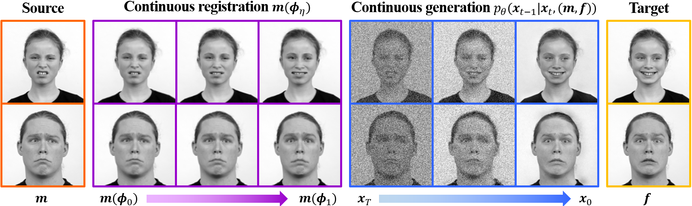

# Our Project (UVA)

Our project is to take DiffuseMorph and do generalizability testing on it. 

```extra reqs for Rivanna
pip install typing-extensions==4.3.0
pip install dominate
pip install visdom
```

setup visdom server using
```
python3 -m visdom.server
```

Due to the original implementation of DiffuseMorph and its lack of documentation, the training step is burdensome and must be done manually.

First, we must make folders of image pairs and place them in /toy_sample/. Next, we name one "train" and run the training code: 

```train
python3 main_2D.py -p train -c config/diffuseMorph_train_2D.json
```

This gives us the start of the model. Next, we change make the trianing folder the next image fair we want to work on. Next, we change the diffuseMorph_train_2D.json file to set the resume state to be the last checkpoint of the previous training run and increment the n_epochs variable by 40. Repeat these steps until we hit every single training pair. The very last checkpoint is our trained model.

We understand that this is very tedious and could be automated. We simply didn't not have enough time to come up with a working script that moves files around and modifies the config files. The lack of any documentation from the original team leads us to believe they do not have any other intended way of training the model with many pairs of images. 

To test, make folders of image pairs to test in the same /toy_sample/ directory with the filename test. Modify diffuseMorph_test_2D.json file to make the resume state our trained model. Now you can run on as many test image pairs as you want to.

Aside about downsampling the brain slices:
The original brain images were of the dimensions 256x256x8. To use DiffuseMorph in 2D, slicing of the images must occur to convert them into 256x256 images. Additionally, the large image size can significantly increase computation time; in order to lower the computation time, images were downsampled to 64x64 - therefore, each 256x256x8 scan was converted into eight 64x64 images using skimage.transform.resize.

Ensure that, when using grayscale images that do not have RGB channels, that the image is tiled; i.e. a 64x64 image should be tiled (using numpy) to create a 64x64x3 image.
This is automatically performed for 2D images that do not have RGB channels associated with them on import.


### The remainder of the README is directly their original work.



# DiffuseMorph

This repository is the official implementation of "DiffuseMorph: Unsupervised Deformable Image Registration Using Diffusion Model" which is presented at ECCV 2022.

[[ECCV paper](https://link.springer.com/chapter/10.1007/978-3-031-19821-2_20)]

## Requirements
  * OS : Ubuntu
  * Python >= 3.6
  * PyTorch >= 1.4.0

## Data
In our experiments, we used the following datasets:
* 2D facial expression images: [RaFD dataset](https://rafd.socsci.ru.nl/RaFD2/RaFD?p=main)
* 3D cardiac MR images: [ACDC dataset](https://acdc.creatis.insa-lyon.fr/description/databases.html)
* 3D brain MR images: [OASIS-3 dataset](https://www.oasis-brains.org/)

## Training

To train our model for 2D image registration, run this command:

```train
python3 main_2D.py -p train -c config/diffuseMorph_train_2D.json
```
To train our model for 3D image registration, run this command:

```train
python3 main_3D.py -p train -c config/diffuseMorph_train_3D.json
```

## Test

To test the trained our model for 2D image registration, run:

```eval
python3 main_2D.py -p test -c config/diffuseMorph_test_2D.json
```

To test the trained our model for 3D image registration, run:

```eval
python3 main_3D.py -p test -c config/diffuseMorph_test_3D.json
```

## Citation

```    
@inproceedings{kim2022diffusemorph,
  title={DiffuseMorph: Unsupervised Deformable Image Registration Using Diffusion Model},
  author={Kim, Boah and Han, Inhwa and Ye, Jong Chul},
  booktitle={European Conference on Computer Vision},
  pages={347--364},
  year={2022},
  organization={Springer}
}
```
